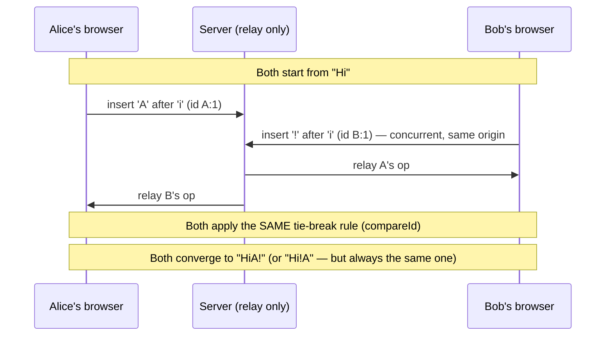

# collabtext

A real-time collaborative text editor, built around a **CRDT (Conflict-free
Replicated Data Type) implemented from scratch** — the same class of
algorithm behind Google Docs, Figma's multiplayer cursors, and Notion's sync
engine. No operational-transform server, no locking, no "last write wins":
every connected client can edit at the same instant, and every replica is
guaranteed to converge on the exact same document regardless of the order
edits happen to arrive in.

```
Alice types "Hello"        Bob types "world" (same instant, same cursor spot)
        \                                /
         \                              /
          v                            v
              Both replicas converge to the same text,
              deterministically, with no coordination.
```

## Why this exists

Most portfolio projects are CRUD apps with a database behind them. This one
is a distributed-systems problem: **how do you let multiple people edit the
same document at once, over an unreliable network, with no central lock, and
guarantee they never end up looking at different text?**

That's a genuinely hard problem (it's an active research area), and solving
it — correctly, with tests that prove it — is a very different signal than
"I built another to-do list."

## How it works

### The core algorithm: RGA (Replicated Growable Array)

Every character in the document gets a unique id the moment it's typed, and
remembers the id of the character it was typed immediately after (its
"origin") — not its position in the string, because positions shift under
concurrent edits but a reference to a specific character never does.

When two people type at the same spot at the same time, both inserts share
the same origin. That's a genuine conflict, and every replica must resolve
it the same way without talking to each other first. The fix: a **total
order over character ids** (see `compareId` in `crdt/types.ts`) that every
replica applies identically, so ties always break the same way everywhere.

Deletes never actually remove a character — they mark it a *tombstone*, so a
delete that arrives after a concurrent insert next to it still has something
to anchor to.



Full writeup with the actual insert/merge algorithm and reasoning is in the
doc comment at the top of `server/src/crdt/rga.ts`.

### Handling out-of-order delivery

A WebSocket delivers one sender's own messages in order, but a client can be
relayed messages from several senders whose *relative* arrival order isn't
guaranteed, and a reconnect can deliver a burst out of sequence. If an
insert's origin (or a delete's target) hasn't arrived yet, it's buffered and
automatically replayed the moment its dependency shows up — see the
`pending` map in `rga.ts`. This was **found by a failing test**, not
designed up front: an early version silently misplaced such ops at the
document start. See "How this was actually verified" below.

### Architecture

```
┌─────────────┐   WebSocket    ┌─────────────┐   WebSocket    ┌─────────────┐
│  Browser A  │◄──────────────►│   Server    │◄──────────────►│  Browser B  │
│             │                │             │                │             │
│  RGA (local │                │  RGA (holds │                │  RGA (local │
│  replica)   │                │  the auth-  │                │  replica)   │
│             │                │  oritative  │                │             │
│  <textarea> │                │  doc so new │                │  <textarea> │
└─────────────┘                │  joiners get│                └─────────────┘
                                │  a snapshot)│
                                └─────────────┘
```

- **`server/`** — Node.js + TypeScript. A `ws` WebSocket server that relays
  ops between clients in the same document ("session"), and keeps its own
  RGA replica so a client joining mid-session gets caught up with a single
  snapshot instead of replaying the full op history.
- **`client/`** — React + TypeScript (Vite). A plain, controlled
  `<textarea>`; a small diff routine (`client/src/crdt/diff.ts`) converts
  "old value → new value" into CRDT ops, which is what makes it correctly
  handle typing, backspace, paste, and cut without needing a custom
  contenteditable implementation.
- **Presence** — the server tracks who's connected to each document and
  broadcasts join/leave events, so every client sees a live list of who
  else is editing.

## Running it

Requires Node 18+.

```bash
# Terminal 1 — server
cd server
npm install
npm run dev          # ws://localhost:4000

# Terminal 2 — client
cd client
npm install
npm run dev          # http://localhost:5173
```

Open `http://localhost:5173` in two different browser tabs (or two
browsers), join the same document name in both, and type in one — it
appears in the other instantly.

## How this was actually verified

Not just "it compiles" — every layer has real, passing tests:

```bash
cd server && npm test   # 9 tests — CRDT convergence, out-of-order delivery, snapshots
cd client && npm test   # 18 tests — same CRDT suite (client-side replica) + textarea diffing
cd e2e && npm install && node two-tab-sync.mjs   # 5 checks — two REAL browser tabs, real WebSocket
```

The unit tests specifically try to break convergence: concurrent inserts at
the same position, concurrent insert-next-to-a-delete, double-deleting the
same character from two replicas, and ops arriving in randomly shuffled
order across four simulated replicas at once. Two of these tests failed on
the first implementation and caught real bugs — a test-harness miscount, and
the out-of-order-delivery bug described above — before any of this touched
a browser.

The end-to-end test (`e2e/two-tab-sync.mjs`) drives two independent Chrome
browser contexts against the actual running server and client — no mocks —
and asserts that concurrent typing in both tabs converges to identical text.

## Known trade-offs (and why)

Being upfront about these is deliberate — a real engineer reviewing this
should see that the choices were made, not missed:

- **CRDT types are duplicated** between `server/src/crdt` and
  `client/src/crdt` rather than pulled from a shared package. For a project
  this size, adding a monorepo/workspace layer would be more scaffolding
  than the problem needs. A larger version of this would hoist it into a
  shared package so the two copies can't drift apart.
- **`integrate()` is O(n) per character, so a large document is O(n²)** in
  the worst case for a long typing session, because it does a linear scan
  to resolve origins. This is a well-known real limitation of naive RGA —
  production CRDTs like Yjs solve it with more sophisticated indexing
  (skip lists, B-trees keyed by position). Fine for a document sized like a
  chat message or a short doc; the wrong choice if you were building this
  for a 50,000-word manuscript without further work.
- **No persistence** — documents live in server memory and are lost on
  restart. Adding it is straightforward (the whole document state is
  already just `RGA.toSnapshot()`, a plain JSON-serializable array) but was
  left out to keep the demo's moving parts minimal.
- **Cursor position isn't remapped through remote edits** — if someone else
  edits before your cursor while you're mid-selection, your cursor can
  drift by the length of their edit. This is a genuinely hard UI problem
  even in production editors, not a shortcut specific to this project.

## Stack

TypeScript end to end · React 18 · Vite · `ws` (WebSocket) · Jest (server) ·
Vitest (client) · Playwright (end-to-end)
